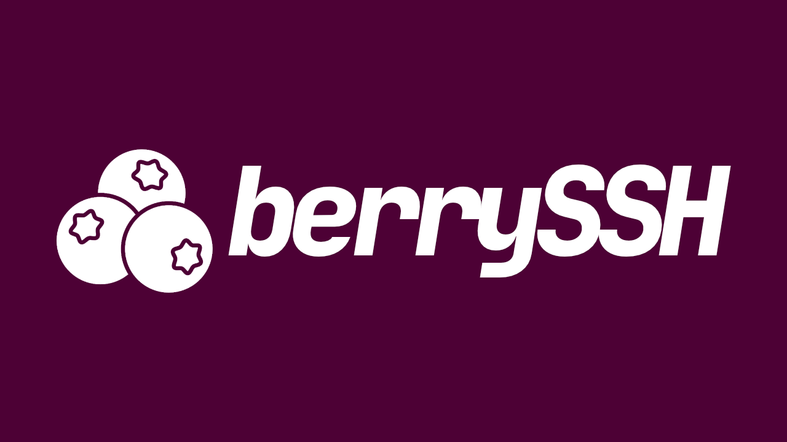

<p align="center">
  
</p>

<p align="center">
  An SSH client for BlackBerry OS 7, written as a plain MIDP 2.0 / CLDC 1.1
  MIDlet.
</p>

<p align="center">
  <a href="https://github.com/cobanov/berryssh/releases/latest"></a>
  
  
  <a href="LICENSE"></a>
</p>

---

It speaks `curve25519-sha256`, `ssh-ed25519` and
`chacha20-poly1305@openssh.com` — the algorithms a current OpenSSH offers by
default, so a phone from 2011 can reach a modern server without that server
being weakened to meet it.

Target hardware is a **BlackBerry Bold 9790**: a 480×360 screen, a hardware
QWERTY keyboard, and a real terminal on it.

- **No BlackBerry tooling, and no signature.** Everything is standard MIDP and
  CLDC, so the build needs no RIM SDK and the device asks for no certificate.
- **The cryptography is here**, because CLDC has no `java.security`, no
  `javax.crypto` and no `BigInteger`.
- **A real terminal** — VT320 emulation drawn from a bitmap font atlas, 60×25,
  rather than MIDP's three font sizes.
- **Saved connections and host key trust**, kept in RMS on the handset.
- **Reaches servers it cannot route to**, through an authenticated WebSocket
  bridge.

**[The wiki](https://github.com/cobanov/berryssh/wiki)** is where to start if you
want to use it rather than read it —
[installing](https://github.com/cobanov/berryssh/wiki/Installing),
[remote servers](https://github.com/cobanov/berryssh/wiki/Remote-servers), and
[troubleshooting](https://github.com/cobanov/berryssh/wiki/Troubleshooting),
which on this platform is mostly a list of failures that produce no error
message.

## Install

Open **http://berryssh.cobanov.run/** in the handset's own browser, over Wi-Fi.

Plain HTTP is not laziness. An OS 7.1 browser offers TLS 1.0 at best and its
trust store predates every currently issued CA, so a modern edge cannot serve it
at all — `cobanov.dev` refuses TLS 1.0 outright and redirects HTTP to HTTPS,
which puts it out of reach whatever is behind it. `cobanov.run` does not
redirect, which is the entire reason it is the host.

The descriptor has to arrive as `text/vnd.sun.j2me.app-descriptor` and the jar
as `application/java-archive`. Served as anything else the browser displays the
descriptor as text instead of installing it, with no error to explain why.
`tools/deploy.md` describes how that is wired.

To serve a local build instead:

```sh
python3 tools/ota_server.py out
```

## Build

No BlackBerry SDK is involved. Dependencies are fetched, not vendored.

```sh
lib/fetch.sh          # MIDP/CLDC stubs and ProGuard, from Maven Central
./build.sh            # -> out/berryssh.jad + berryssh.jar
tools/make_atlas.sh   # font atlases, only if the character set changes
```

The compiler is JDK 8 in a container at `-source 1.3 -target 1.3`, because a
host JDK 17 cannot emit class file version 47 and that is what CLDC wants.

**Preverification is mandatory.** A MIDlet that is merely compiled installs and
then fails on the device with:

```
907 Invalid JAR — missing stack map in startApp at label 43
```

CLDC's verifier wants `StackMap` attributes computed ahead of time, and modern
`javac` emits the Java 6+ `StackMapTable` or nothing at this target. ProGuard's
`-microedition` mode produces them without a native preverifier.

## Verify

```sh
spike2/run.sh                     # 228 assertions, nothing external needed
spike2/against-server.sh          # 41 more, against a real OpenSSH
```

`run.sh` compiles against the CLDC bootclasspath at `-source 1.3` and then runs
the vectors on the host JVM: compiling under the device's constraints proves the
code will run there, executing on the host proves it is correct, and neither
half needs the phone. They run under a Turkish default locale — the device's own,
and the setting most likely to break protocol code without raising an error
anywhere.

Encodings can be proved offline; a protocol cannot. A key exchange either
convinces OpenSSH or it does not, so the other half talks to one — including a
server that rekeys every 64 KB and a bridge that has to refuse a wrong key and a
machine that is not on its list. Absent servers print `SKIP` rather than passing
quietly.

## How it is built

**No RIM APIs, deliberately.** BlackBerry code signing is a runtime check inside
the device VM that fires when a module touches a protected API, and every
signature had to come from a signing authority that no longer exists. Code that
touches no protected API needs no signature.

**Modern cryptography is the cheap option here**, which is the opposite of what
it sounds like:

| | Why it suits this hardware |
| --- | --- |
| `curve25519-sha256` | Fixed 32-byte field arithmetic instead of 2048-bit modular exponentiation, and no `BigInteger` |
| `ssh-ed25519` | The same curve arithmetic, nothing extra to carry |
| `chacha20-poly1305` | Pure 32-bit add/xor/rotate, no tables; AEAD, so no separate MAC |
| `SHA-256` | Small and self-contained |

The 2011 SSH stack is anchored on 2048-bit modexp, which is genuinely slow in
interpreted Java on this class of CPU.

### Measured on the device

`spike1` is a capability probe rather than a hello world. On a Bold 9790:

| | |
| --- | --- |
| Canvas | 480×360, full screen |
| Default encoding | `ISO8859_1`, so UTF-8 is converted in our own code |
| Free heap | ~357 MB — memory is not a constraint |
| MIDP monospace cell | 22×27 px, giving a 21×13 terminal |

That last row is why the terminal draws from a bitmap atlas: MIDP offers three
font sizes and the smallest is far too large. An 8×14 cell gives the 60×25 this
screen should have.

## Prior art

[BBSSH](https://github.com/marcparadise/bbssh) by Marc Paradise was *the* SSH
client for these devices and solved a lot of problems well. berryssh is a
separate implementation with a different architecture and different algorithms,
but it borrows where BBSSH already got it right, credited in the files that use
it: the `VT320` emulator (originally from [JTA](http://javatelnet.org/) by
Matthias L. Jugel and Marcus Meissner) and the `BitmapFont` renderer, derived
from Roar Lauritzsen's LCDFont.

Not the font atlases. Those covered U+0020 to U+00FF and nothing else, leaving
Turkish `ğ ı ş İ` and the whole box-drawing range without glyphs. They are
generated now from DejaVu Sans Mono, whose licence permits redistributing what
is rendered from it — where baking in Menlo or Courier New would put a
derivative of a proprietary typeface into a GPL project.

A verified copy of BBSSH, including binaries that survive nowhere else, is
preserved at [cobanov/bbssh-archive](https://github.com/cobanov/bbssh-archive).

## Licence

GPL-2.0-or-later, matching BBSSH, whose code this project reuses.
